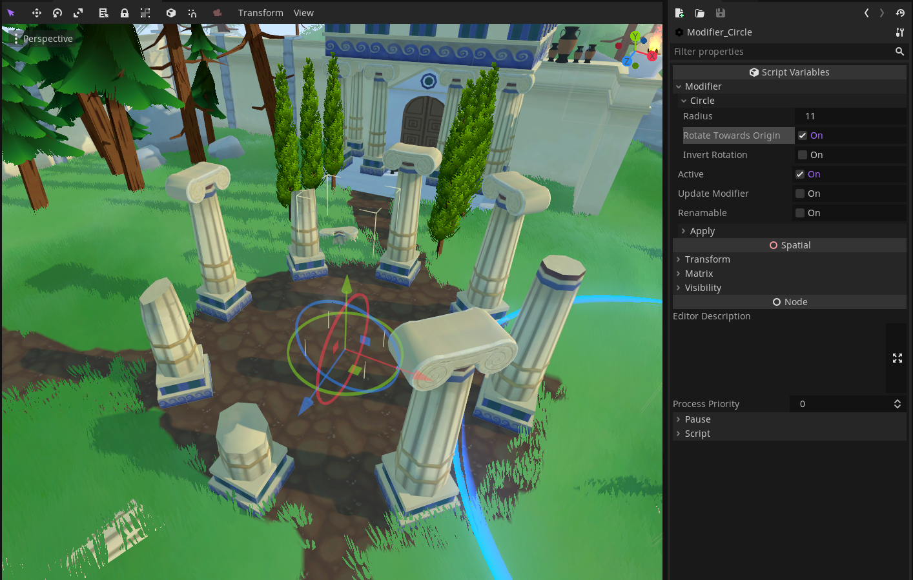

# Godot : Level design modifiers



Godot in editor tools to place nodes in a non destructive way, similar to Blender's modifier stack.

- [Level design modifiers](#Godot-level-design-modifiers)
  -   [Features](#features)
  -   [Installation](#installation)
      - [Via Editor AssetLib](#via-editor-assetlib)  
      - [Via git](#via-git)
  - [Usage](#usage)
  - [Creating your own modifier](#creating-your-own-modifier)
  - [License](#license)


## Features

- A set of modifier nodes :
  - Circle : place nodes in a circle.
  - Array : repeat nodes in a given direction.
  - Mirror :  create a symmetric version of the nodes.
  - Randomize : randomize the transforms of nodes using a given seed. Useful to place nodes in a random pattern.
- Each modifier has its own set of parameters.
- Stackable : you can stack any modifier together, example : mirroring an Array.
- Non destructive : the original transforms are saved, so you can put your nodes back the way they were if needed.
- In editor, usable while working on your level design.
- Affects children : every child node of the modifier will be affected.

## Installation

### Via Editor AssetLib
(Support for AssetLib coming soon)

### Via Git

1. Clone this project into your `addons` folder.

You should get this structure :

```
res://
├── addons
│   ├── modifiers
│   ├── ...

```

2. Open `Project > Project Settings > Plugins`, search for `modifiers` and check the Enable checkbox.
3. You should now be able to add Modifier's nodes in your scenes.
4. You can open the demo `modifiers > demo > modifiers_demo.tscn` to get an idea of how it works.


## Usage

- Add one of the Modifier nodes in the scene (CircleModifier, ArrayModifier, MirrorModifier or CircleModifier).
- Add every node that should be affected by the modifier as a child.
- In the inspector, you see a new set of parameters : 
  - "Modifier" tab is common to all modifiers. 
    -  Active : (de)activate the modifier to see its effect.
    -  Update modifier : modifiers don't auto update when you move their children. This button allows you to do it manually.
    -  Renamable : modifiers nodes are automatically renamed. If you want to avoid this, check this box.
  -  "Name of the modifier" tab is specific to each modifier. Each parameter should be quite self explanatory. 
  -  "Apply" tab : delete the modifier script and keep nodes transforms as they are (lose the non destructive aspect).


## Creating your own modifier

Adding your own modifiers is possible with a little bit of code.
- Create a new script in `modifiers > src`
- Your script must be a tool script and extend the Modifier class.
- Add a function `func modify()`. 
  -   This is the main function of the modifier, called at each modifier's update.
  -   When changing transform, try not use local space as much as possible. This ensures that the modifier own's transform influence its children's.
-   You can add your own properties by adding functions `_get(property)` and `func _set(property, value)`.
- Tip : check out the code of the other modifiers to understand how each of these functions works.

Feel free to make pull requests to add your own modifiers.


# License

Licensed under the MIT license, see `LICENSE` for more information.
